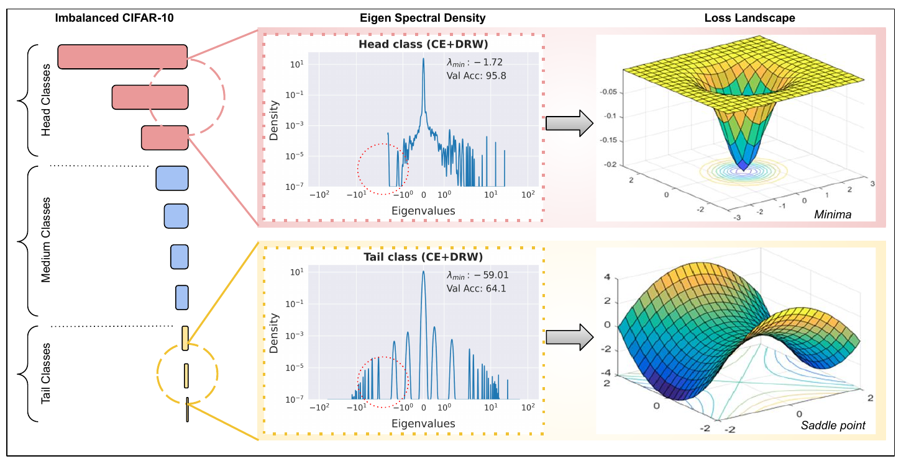

# <div align="center">Escaping Saddle Points for Effective Generalization on Class-Imbalanced Data</div>

<font size = "3">**Harsh Rangwani\*, Sumukh K Aithal\*, Mayank Mishra, R. Venkatesh Babu**</font>


This is the official PyTorch implementation for our NeurIPS'22 paper: **Escaping Saddle Points for Effective Generalization on Class-Imbalanced Data** [[`OpenReview`](https://openreview.net/pdf?id=9DYKrsFSU2)]  [[`arXiv`](http://arxiv.org/abs/2212.13827)] 


## Abstract
<div align="center">
  
</div>

Real-world datasets exhibit imbalances of varying types and degrees. Several techniques based on re-weighting and margin adjustment of loss are often used to enhance the performance of neural networks, particularly on minority classes. In this work, we analyze the class-imbalanced learning problem by examining the loss landscape of neural networks trained with re-weighting and margin based techniques. Specifically, we examine the spectral density of Hessian of class-wise loss, through which we observe that the network weights converges to a saddle point in the loss landscapes of minority classes. Following this observation, we also find that optimization methods designed to escape from saddle points can be effectively used to improve generalization on minority classes. We further theoretically and empirically demonstrate that Sharpness-Aware Minimization (SAM), a recent technique that encourages convergence to a flat minima, can be effectively used to escape saddle points for minority classes. Using SAM results in a 6.2% increase in accuracy on the minority classes over the state-of-the-art Vector Scaling Loss, leading to an overall average increase of 4% across imbalanced datasets. 

**TLDR:**  Tail class loss landscape converges to a saddle point in imbalanced datasets and SAM can effectively escape from these solutions. 


## Getting started

* ### Requirements
	<ul>
	<li>pytorch 1.9.1</li>
	<li>torchvision 0.10.1</li>
	<li>wandb 0.12.2</li>
	<li>timm 0.5.5</li>
	<li>prettytable 2.2.0</li>
	<li> scikit-learn </li>
	<li> matplotlib </li>
	<li> tensorboardX </li>
	</ul>
* ### Installation
```
git clone https://github.com/val-iisc/Saddle-LongTail.git
cd Saddle-LongTail
pip install -r requirements.txt
```
We use Weights and Biases ([wandb](https://wandb.ai/site)) to track our experiments and results. To track your experiments with wandb, create a new project with your account. The ```project``` and ```entity``` arguments in ```wandb.init``` must be changed accordingly in .py file for each experiment. To disable wandb tracking, the ```log_results``` flag can be **removed**. 

* ### Datasets
   The datasets used in the repository can be downloaded by following instructions from the following links:
	   <ul>
	   <li>[iNaturalist-18](https://github.com/visipedia/inat_comp/tree/master/2018)</li>
       <li>[ImageNet-LT](https://github.com/zhmiao/OpenLongTailRecognition-OLTR) </li>
	   </ul>
	The CIFAR datasets are automatically downloaded to the ```data/``` folder if it is not available.

## Training

Sample command to train CIFAR-10 LT dataset with CE+DRW+SAM.

`python cifar_train_sam.py --gpu 0 --imb_type exp --imb_factor 0.01 --loss_type LDAM --train_rule DRW --rho 0.8 --rho_schedule none --log_results --dataset cifar10 --seed 0`

Sample command to train ImageNet-LT dataset with LDAM+DRW+SAM. 

`python imnet_train_sam.py --gpu 0 --imb_type exp --imb_factor 0.01 --data_path <Path-to-Dataset> --loss_type LDAM --train_rule DRW --dataset imagenet -b 256 --epochs 90 --arch resnet50 --cos_lr --rho_schedule step --lr 0.2 --seed 0 --rho_steps 0.05 0.1 0.5 0.5 --log_results --wd 2e-4 --margin 0.3`

All the commands to reproduce the experiments are available in `run.sh` 

### Results and Checkpoints of Models
We show results on CIFAR-10 LT, CIFAR-100 LT, ImageNet-LT and iNaturalist-18 dataset. Complete results is available in the paper.
<div align="center">
<table>
    <thead>
        <tr>
            <th>Dataset</th>
            <th>Method</th>
            <th>Accuracy</th>
            <th>Checkpoints</th>
        </tr>
    </thead>
    <tbody>
        <tr>
            <td rowspan=2> CIFAR-10 LT (IF=100)</td>
            <td>LDAM+DRW+SAM</td>
            <td>81.9</td>
            <td><a href="https://drive.google.com/uc?export=download&id=1c5iSVphqwF2sMkEkmwZABS5BY6cL125d">ckpt</a>
            </td>
        </tr>
        <tr>
            <td>CE+DRW+SAM</td>
            <td>80.6</td>
            <td><a href="https://drive.google.com/uc?export=download&id=14RyrpqbmgY-cWNLmDpiJBTO3-kQYCIfb">ckpt</a>
            </td>
        </tr>
		<tr>
            <td rowspan=2> CIFAR-100 LT (IF=100)</td>
            <td>LDAM+DRW+SAM</td>
            <td>45.4</td>
            <td><a href="https://drive.google.com/uc?export=download&id=1qqvZ72OmGOYUgSSDfi-tWPR0hnC7En3u">ckpt</a>
            </td>
        </tr>
        <tr>
            <td>CE+DRW+SAM</td>
            <td>44.6</td>
            <td><a href="https://drive.google.com/uc?export=download&id=1UIjO-MCAm5HyxV0eixfAQzhWlTAt1Md-">ckpt</a>
            </td>
        </tr>
		<tr>
            <td rowspan=2> ImageNet-LT</td>
            <td>LDAM+DRW+SAM</td>
            <td>53.1</td>
            <td><a href="https://drive.google.com/uc?export=download&id=1krmLBDoBmFSEP3LnUy7A2qneWgVItVg3">ckpt</a>
            </td>
			<tr>
            <td>CE+DRW+SAM</td>
            <td>47.1</td>
            <td><a href="https://drive.google.com/uc?export=download&id=1J3NxO_S8CquvUwsLG7Q7CGH2N7zWIi1z">ckpt</a>
            </td>
        </tr>
		<tr>
            <td rowspan=2> iNaturalist-18</td>
            <td>LDAM+DRW+SAM</td>
            <td>70.1</td>
            <td><a href="https://drive.google.com/file/d/1Jh0EyBf8Uc6XlR9kghjI_an-Fr9uIQ6E/view?usp=share_link">ckpt</a>
            </td>
			<tr>
            <td>CE+DRW+SAM</td>
            <td>65.3</td>
            <td><a href="https://drive.google.com/uc?export=download&id=1YcgKQz-3KEARp89rREK0yN1-cz3D3cHi">ckpt</a>
            </td>
        </tr>
        </tr>
    </tbody>
</table>
</div>


## **Class-Wise** Hessian Analysis

We also release the code to compute the spectral density and analyse the loss landscape of the trained models. 

Sample command below:

`python hessian_analysis.py --gpu 0 --seed 1 --exp_str sample --resume <checkpoint_path> --dataloader_hess train --log_results`

On running this command, the Eigen Spectral density of per-class loss is computed and the class-wise spectral density is plotted along with the maximum eigenvalue and the trace of the Hessian.

## Overview of the arguments 

Generally, all python scripts in the project take the following flags
- `-a`: Architecture of the backbone. `(resnet32|resnet50)`
- `--dataset`: Dataset `(cifar10|cifar100)` 
- `--imb_type`: Imbalance Type `(Exp|Step)`.
- `--imb_factor`: Imbalance Factor (Ratio of samples in the minority class to majority class). Default: 0.01    
- `--epochs`: Number of Epochs to be trained for. Default 200.
- `--loss_type`: Loss Type `(CE|LDAM|VS)`
- `--gpu`: GPU id to use.
- `--rho`: $\rho$ value in SAM (Applicable to SAM runs).

## Acknowledgement
Our implementation is based on the [LDAM](https://github.com/kaidic/LDAM-DRW) and [VS-Loss](https://github.com/orparask/VS-Loss). We use the PyTorch implementation of SAM from https://github.com/davda54/sam. We refer to [PyHessian](https://github.com/amirgholami/PyHessian) for computation of the Eigen Spectral density and the loss landscape analysis. We thank the authors for releasing their source-code publicly.

## Citation
If you find our paper or codebase useful, please consider citing us as:
```latex
@inproceedings{
rangwani2022escaping,
title={Escaping Saddle Points for Effective Generalization on Class-Imbalanced Data},
author={Harsh Rangwani and Sumukh K Aithal and Mayank Mishra and Venkatesh Babu Radhakrishnan},
booktitle={Advances in Neural Information Processing Systems},
editor={Alice H. Oh and Alekh Agarwal and Danielle Belgrave and Kyunghyun Cho},
year={2022},
url={https://openreview.net/forum?id=9DYKrsFSU2}
}
```

